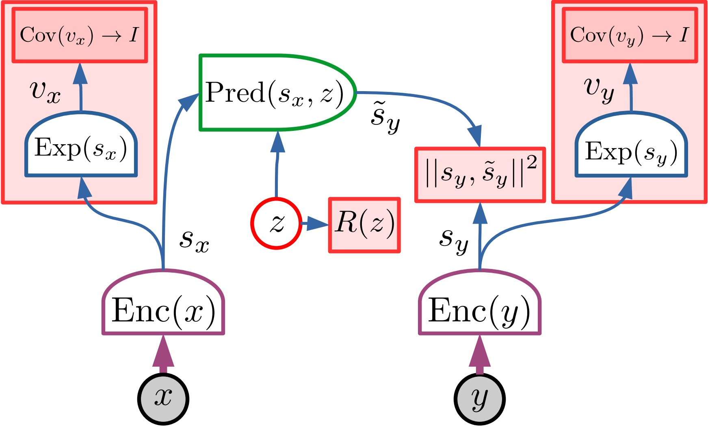
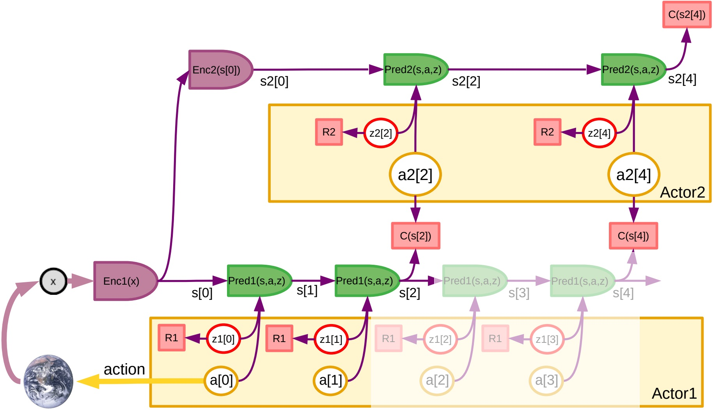

# JEPA

(wip) Hierarchical Joint Predictive Predictive Architecture (H-JEPA)

Based on the architecture proposed in "A Path Towards Autonomous Machine Intelligence" by Yann LeCun. www.openreview.net/pdf?id=BZ5a1r-kVsf

  
&nbsp;

  
  
  
JEPA architecture | Hierarchial JEPA 

<!--  -->

Procgen - BigFish (wip)

